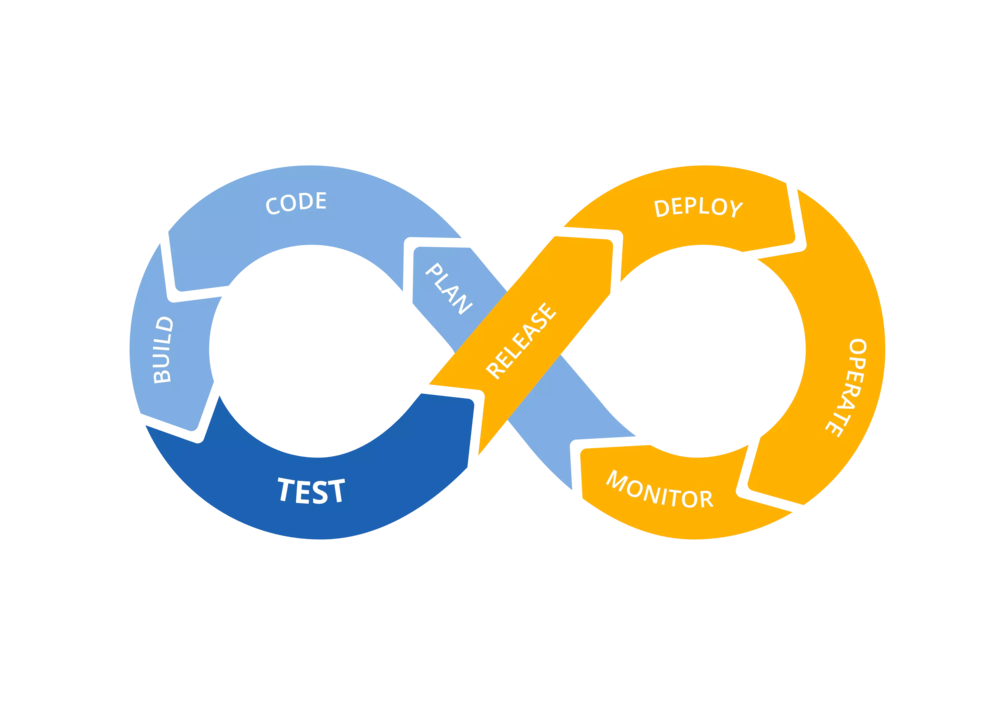

# CI/CD Pipeline with Jenkins

## Introduction
Jenkins CI/CD pipeline automate the integration, stagging and deployment process.
Manual integration, test and deployments can lead to errors that a well defined CI/CD pipeline can avoide while testing the application.

## What is a Pipeline?
 A continuous delivery (CD) pipeline is an automated expression of your process for getting software from version control right through the end users.

[simple link](https://www.google.com )  

[with optional title](https://www.google.com "Google's Homepage")  

	
	

* `mkdocs new [dir-name]` - Create a new project.
* `mkdocs serve` - Start the live-reloading docs server.
* `mkdocs build` - Build the documentation site.
* `mkdocs help` - Print this help message.

## Project Scope

    mkdocs.yml    # The configuration file.
    docs/
        index.md  # The documentation homepage.
        ...       # Other markdown pages, images and other files.
